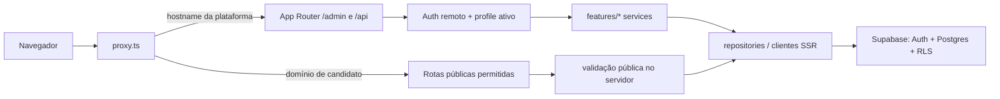
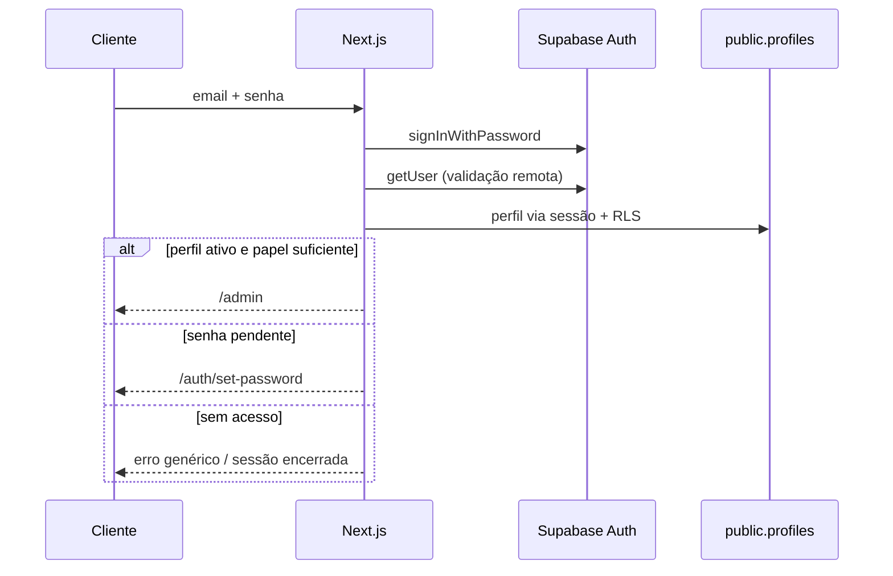
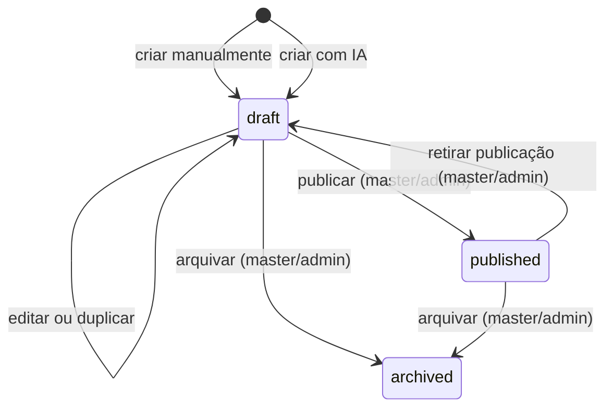

# Arquitetura do OKA Admin

Este documento descreve o desenho atual, os limites entre camadas e os contratos que devem ser preservados durante a evolução da plataforma. Para schema e migrations, consulte [DATABASE.md](DATABASE.md) e [MIGRATION.md](MIGRATION.md).

## Visão geral

O projeto é uma aplicação Next.js 16 com App Router. A mesma aplicação atende dois contextos:

1. o hostname da plataforma, com painel autenticado, Auth e APIs administrativas;
2. domínios públicos de candidatos, limitados a páginas e submissões de campanha.

O Supabase fornece Postgres, Auth e RLS. Clientes SSR usam cookies e a chave publicável. Operações excepcionais, como convite de usuário, usam um cliente administrativo `server-only` depois de uma verificação explícita de papel.

## Camadas e responsabilidades

| Camada | Responsabilidade | Não deve fazer |
| --- | --- | --- |
| `app/` | Rotas, composição de Server/Client Components, redirects e protocolo HTTP | Duplicar regras de autorização ou consultas complexas |
| `components/` | UI compartilhada, acessibilidade e renderização | Decidir papéis ou usar a Secret key |
| `features/<domínio>/` | Schemas, regras de negócio, serviços, repositórios e actions do domínio | Confiar em dados de autorização enviados pelo cliente |
| `lib/supabase/` | Clientes SSR, proxy, admin e tipos gerados | Transformar o cliente admin em acesso genérico |
| `lib/` | Adapters transversais e compatibilidade | Criar uma segunda fonte de regra já pertencente a `features/` |
| `config/` | Validação fail-closed do ambiente do servidor | Registrar valores de segredo |
| `supabase/migrations/` | Schema, funções, grants, RLS e mudanças versionadas | Depender de SQL avulso não versionado |

Há código legado em `app/(admin)/`, `lib/supabase.ts` e arquivos SQL avulsos. Ele existe para compatibilidade durante a migração. Novas funcionalidades devem seguir o caminho `app/admin` → `features` → cliente tipado/RLS.

## Roteamento por hostname

`proxy.ts` decide o contexto antes da aplicação:

- no hostname da plataforma, atualiza cookies de sessão Supabase e preserva redirects/rewrites;
- `/` da plataforma redireciona permanentemente para `/admin`;
- em domínio de candidato, força HTTPS, remove `www` e expõe apenas páginas públicas, assets necessários e `/api/assinaturas`;
- `/` de candidato reescreve para `/formularios`;
- `/{uuid}` reescreve para `/formulario/{uuid}` em `GET`/`HEAD`;
- qualquer rota administrativa em domínio de candidato responde `404` com `noindex`;
- redirects antigos preservam links MVC e caminhos administrativos em português.

O refresh de sessão não autoriza o usuário. Ele apenas mantém cookies. Pages, actions e Route Handlers continuam responsáveis por validar identidade, troca de senha e papel. A regra de troca obrigatória vive no guard central para também proteger chamadas diretas a Server Actions.

### Contratos de hostname

- `APP_URL` identifica a origem administrativa canônica;
- domínios de candidato não podem acessar `/admin`, `/login` nem APIs administrativas;
- a raiz e `www` do mesmo domínio devem convergir para o hostname sem `www` e HTTPS;
- links públicos curtos por UUID e o endpoint legado de assinatura não podem ser removidos sem plano de redirecionamento e telemetria.

## Autenticação e autorização

O fluxo usa Supabase Auth com e-mail e senha:

1. `/api/login` chama `signInWithPassword` pelo cliente SSR;
2. `getCurrentAuthContext` usa `auth.getUser()` para validar a identidade remotamente;
3. o perfil é lido de `public.profiles` pelo cliente sujeito a RLS;
4. guards exigem perfil ativo, troca de senha concluída e o papel apropriado;
5. o layout `/admin` redireciona sessão ausente, perfil inativo ou troca de senha pendente.

`public.profiles` é a única fonte de `role` e `is_active`. `user_metadata` não participa de autorização. `app_metadata.password_change_required` é um marcador controlado pelo servidor exclusivamente para o fluxo de convite/recuperação.

### Convites e recuperação

Somente `master` pode operar `features/users/`. O convite:

- não recebe senha;
- usa a Admin API no servidor;
- define o callback em `${APP_URL}/auth/callback?next=/auth/set-password`;
- marca troca obrigatória de senha em `app_metadata`;
- persiste nome, papel e ativação somente em `public.profiles`.

O callback aceita somente caminhos internos seguros e força convite/recuperação para `/auth/set-password`. A senha deve ter de 12 a 128 caracteres, com minúscula, maiúscula, número e símbolo. O serviço também impede auto-desativação e a remoção do último `master` ativo.

## Supabase e acesso a dados

Há três clientes intencionais:

| Cliente | Arquivo | Credencial | Escopo |
| --- | --- | --- | --- |
| SSR | `lib/supabase/server.ts` | `SUPABASE_PUBLISHABLE_KEY` + cookies | Server Components, actions e handlers sujeitos a RLS |
| Proxy | `lib/supabase/proxy.ts` | `SUPABASE_PUBLISHABLE_KEY` + cookies | Refresh de token e propagação segura de cookies |
| Admin | `lib/supabase/admin.ts` | `SUPABASE_SECRET_KEY` | Operações administrativas server-only após guard explícito |

`config/env.ts` valida formato e separação das chaves sem incluir valores na mensagem de erro. `lib/supabase/database.types.ts` é o contrato TypeScript do banco e deve ser atualizado junto com mudanças de schema.

Somente [`../supabase/migrations`](../supabase/migrations) é fonte canônica de mudanças. O conjunto atual estabelece a fundação, aplica o hotfix de exposição da Data API, reconcilia grants autenticados e permite nome opcional no lead para compatibilidade com o form builder. A ordem e a validação estão em [MIGRATION.md](MIGRATION.md).

## Campanhas

`features/campaigns/service.ts` concentra o ciclo de vida. Entradas manuais, duplicações e gerações por IA passam pelo mesmo serviço de criação e retornam `draft` inativo.

Contratos relevantes:

- somente `draft` é editável;
- criação força `status = draft`, `ativa = false`, `published_at = null` e `archived_at = null`;
- slugs são normalizados e recebem sufixo em conflito;
- publicação, retirada e arquivamento exigem `master` ou `admin`;
- cada mutação tenta registrar `campaign_activity`; esse segundo write não forma uma transação única com a campanha, então `AUDIT_FAILED` exige atualizar o estado antes de qualquer retry;
- duplicação sempre cria outro rascunho.

### Geração por IA

`app/api/ai/campaigns/route.ts` valida sessão, perfil, origem, tamanho e rate limit. `features/ai/generator.ts` pede saída estruturada validada por Zod, usa timeout, retries e fallback de modelo. `features/ai/service.ts` converte a saída e chama `createCampaign`; não há caminho de publicação automática.

O modelo é configurado por `AI_MODEL` no formato `provedor/modelo`. A credencial preferencial é `AI_GATEWAY_API_KEY`; `AI_API_KEY` é um alias. Sem chave explícita, o provider padrão do AI SDK pode usar o OIDC disponibilizado pela Vercel.

## Temas e formulários

`features/themes/registry.ts` é a fonte de verdade para identidade, capacidade e status de cada tema. Chaves persistidas são contratos de dados: renomeá-las exige migration e fallback de renderização.

`features/forms/config.ts` normaliza o JSON de formulário, limita campos e opções e mantém consentimento obrigatório. Campanhas sem configuração usam o conjunto legado de campos. A página `/admin/forms` é um índice; a edição ocorre no editor de campanha, na tab de formulário.

## Publicação e assinatura pública

As principais entradas públicas são:

- `/p/[slug]`: campanha publicada por slug;
- `/c/[slug]`: hub do candidato;
- `/formulario/[idCampanha]`: compatibilidade por UUID;
- `/formularios`: índice usado na raiz de domínio personalizado;
- `POST /api/assinaturas`: recebimento validado da assinatura.

A submissão valida origem, `multipart/form-data`, corpo de até 32 KiB, honeypot, campanha disponível, domínio correspondente, consentimento e campos pessoais. A escrita usa o servidor; o navegador não recebe acesso direto de inserção na tabela de leads.

## Leads e exportação

`features/leads/` encapsula filtros, consultas e CSV. Apenas `master` e `admin` podem listar ou exportar.

- paginação de tela: 25 registros;
- busca higienizada antes de compor o filtro PostgREST;
- datas de formulário interpretadas no calendário de São Paulo;
- export em lotes de 250 e máximo de 5.000 linhas;
- CSV com BOM, `;` e neutralização contra formula injection;
- resposta privada, `no-store`, com streaming e eventos de auditoria no log do servidor.

## APIs e limites de aplicação

Os limites abaixo são uma camada por instância. Em produção, o Firewall deve fornecer a camada distribuída.

| Endpoint | Acesso | Limite no código | Corpo/controles principais |
| --- | --- | --- | --- |
| `POST /api/login` | Público | 5 / 15 min | mesma origem, urlencoded, 4 KiB, erro genérico |
| `POST /api/auth/set-password` | Sessão de convite/recovery | 5 / 15 min | mesma origem, urlencoded, 4 KiB, senha forte e confirmação |
| `POST /api/assinaturas` | Público | 10 / min | mesma origem, multipart, 32 KiB, honeypot e consentimento |
| `POST /api/ai/campaigns` | Perfil ativo | 8 / hora por contexto de usuário/rede | mesma origem, JSON, 16 KiB, output Zod |
| `GET /api/admin/leads/export` | `master`/`admin` | 5 / 5 min | mesma origem, filtros validados, máximo de 5.000 linhas |

`lib/request-security.ts` limita também streams sem `Content-Length`. `lib/rate-limit.ts` guarda contadores em memória e usa um hash da origem de rede; portanto não é uma garantia global entre funções serverless.

## Headers, cache e indexação

`next.config.mjs` define CSP, HSTS, proteção contra framing, MIME sniffing, política de permissões e referrer. Login, Auth, painel e rotas administrativas de compatibilidade recebem `private, no-store` e `noindex`.

Respostas que alteram sessão propagam corretamente `Set-Cookie` e headers de cache. Nenhuma resposta personalizada no proxy deve descartar cookies atualizados. Conteúdo dependente de sessão não pode ser colocado em cache público.

## Rotas canônicas

| Contexto | Rotas |
| --- | --- |
| Auth | `/login`, `/auth/callback`, `/auth/set-password` |
| Painel | `/admin` |
| Conteúdo | `/admin/campaigns`, `/admin/campaigns/new`, `/admin/campaigns/[id]/edit`, `/admin/campaigns/ai`, `/admin/themes`, `/admin/forms` |
| Dados | `/admin/leads` |
| Gestão | `/admin/users`, `/admin/settings` |
| Público | `/p/[slug]`, `/c/[slug]` |

Páginas novas não devem apontar para `/campanhas`, `/assinaturas`, `/temas` ou rotas MVC. Esses caminhos existem somente como adapters de compatibilidade. `/candidatos/*` ainda é legado e deve permanecer isolado até uma migração dedicada.

## Contratos que não podem ser quebrados silenciosamente

1. identidade validada remotamente; autorização apenas por perfil ativo;
2. papéis nunca derivados de `user_metadata`;
3. cliente com Secret key apenas no servidor e depois de guard explícito;
4. manual e IA sempre criam rascunho inativo;
5. consentimento de formulário nunca pode ser desativado por JSON;
6. domínios de candidato nunca expõem o painel;
7. URLs públicas legadas permanecem funcionais enquanto houver tráfego dependente;
8. nomes de colunas e chaves de tema persistidas exigem migration/fallback antes de renomear;
9. CSV continua protegido contra fórmula, cache e export ilimitado;
10. toda mudança de schema passa por migration versionada e atualização de tipos/documentação.

## Como adicionar uma funcionalidade

1. defina schema e tipos em `features/<domínio>`;
2. implemente a regra em um serviço `server-only` com guard no início;
3. use repositório/cliente SSR sujeito a RLS; reserve o cliente admin para casos justificados;
4. exponha a operação por Server Action ou Route Handler com validação de origem, tamanho e formato;
5. componha a página em `app/admin` e respeite o papel na navegação;
6. acrescente unitários para invariantes e um teste de integração/E2E para o fluxo;
7. se houver schema, crie uma migration aditiva, atualize os tipos e siga [MIGRATION.md](MIGRATION.md);
8. revise [SECURITY.md](../SECURITY.md) e [DEPLOY.md](../DEPLOY.md) antes da promoção.

## Referências

- [README](../README.md)
- [Banco de dados](DATABASE.md)
- [Migrations](MIGRATION.md)
- [Deploy](../DEPLOY.md)
- [Segurança](../SECURITY.md)
